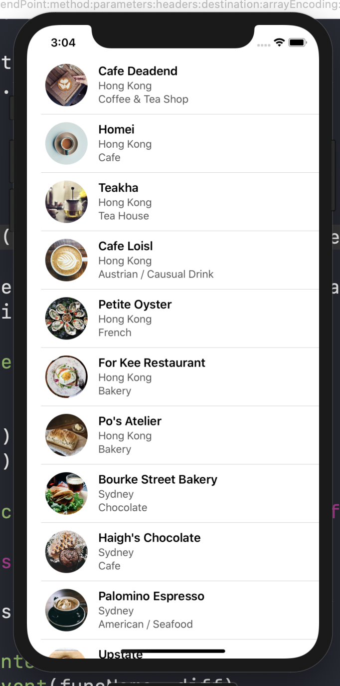

## 2-2 簡易 TableView

### 需求

下圖是你所需完成的

    

UITableView 的規格如下

字型要求

第一行為粗體, font size = 17

第二行為標準體, font size = 17

第三行為 Medium 體, font size = 17


所有圖案放在 `resources/simpletable-images2` 的資料夾內

檔案名為

```
var restaurantImages = ["cafedeadend", "homei", "teakha", "cafeloisl", "petiteoyster", "forkeerestaurant", "posatelier", "bourkestreetbakery", "haighschocolate", "palominoespresso", "upstate", "traif", "grahamavenuemeats", "wafflewolf", "fiveleaves", "cafelore", "confessional", "barrafina", "donostia", "royaloak", "caskpubkitchen"]
```