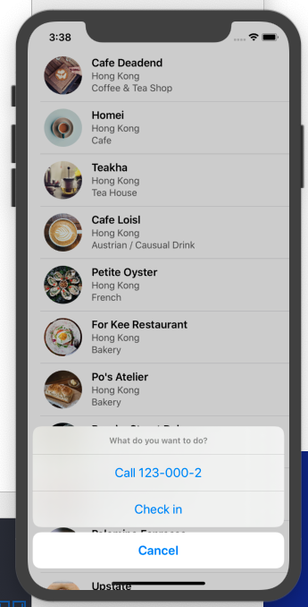

## 1-3 UITableViewDelegate

### 需求

當點擊 UITableViewCell 後，要彈出 alert sheet，裡面有三個選項

* 選項1
  * 秀出 Call 123-000-(所點擊的 row index) (第一張圖)
  * 點擊選項 1 之後，彈出另一個 alert, title: `"Service Unavailable"`, message: `Sorry, the call feature is not available yet. Please retry later.` (如第二張圖)
* 選項2
  * 秀出 Check in 
  * 點擊 Check in 後，右方會出現勾勾 (可用預設勾勾圖) (如第三張圖)
* 選項3
  * 透出 Cancel
  * 點擊 Cancel 後退出 Alert sheet

