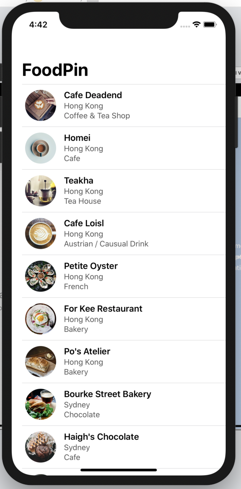

## 2-4 使用網路上的資料進行製作一個餐廳的 UITableView

在 `Mission 2-3` 你完成了發動 API request，進行資料的拿取。

現在，你需要重寫之前 View Controller 裡面的 UITableView 相關程式碼。

你的資料來源要從 `Mission 2-3` 拿到，在拿到資料後，要進行 `UITableViewCell` 的渲染。

UI 如下，基本上和 `Mission 2-1` 一樣，照理來說，你要更改資料來源而已。

這個 Mission 完成的時候， Navigation Controller 的功能應該也要正常運作，每個 Cell 點擊後，要滑入 Detail 頁面

另外，餐廳的圖檔 base url 如下

`https://raw.githubusercontent.com/cmmobile/ImprovementProject/master/info/pic/restaurants`

如果你拿到的資料中，photo: `barrafina.jpg`

那圖片網址就是 `https://raw.githubusercontent.com/cmmobile/ImprovementProject/master/info/pic/restaurants/barrafina.jpg`

