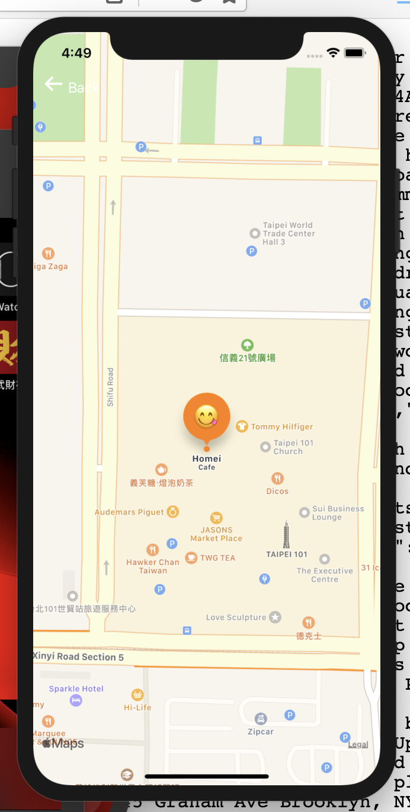

## 2-7 在 UITableViewCell 內裝入 MapView

### 需求

在 detail page 內加一個 cell，裡面裝上 MapView

理論上， map view 的中心，應該是每個餐廳的位置。

但這一道 API 不是我們公司主要的任務，你可以先用 Taipei 101 的座標代替。

台北 101 : `var coordinate: CLLocationCoordinate2D = CLLocationCoordinate2DMake(25.034132, 121.564206)`

detail page 的地圖，在點擊後，會滑入另一個全螢幕地圖的 VC。

全螢幕地圖 VC 的中心也可以定在台北 101. 

